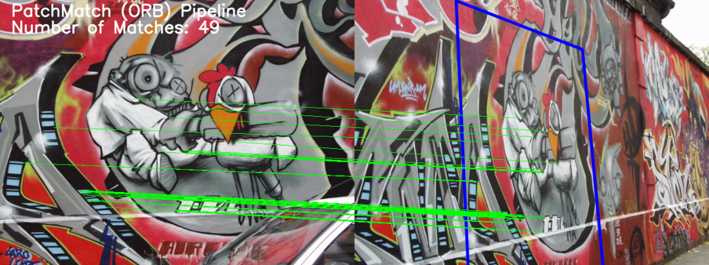

# :camera: PatchMatch: Fast, Efficient and Robust Image Matching




## Table of Contents
- [Introduction](#introduction)
  - [Working Principle](#working-principle)
  - [Motivation](#motivation)
  - [Capabilities](#capabilities)
  - [PatchMatch Model Architecture](#patchmatch-model-architecture)
- [Installation](#installation)
- [Usage](#usage)
  - [Dataset Preparation](#dataset-preparation)
  - [Training](#training)
  - [Quantize-Aware Training](#quantize-aware-training)
  - [Evaluation](#evaluation)
  - [Inference](#inference)
- [Features](#features)

## Introduction
Introducing PatchMatch, a lightweight image matching pipeline for fast,
robust and efficient image matching. PatchMatch is built on local image
features such as ORB, SIFT and uses a lightweight CNN model to improve
matching rather than relying solely on the descriptor-based matching.
Improved matching performance is observed in multiple challenging cases
as compared to local descriptor-based matching. The name "PatchMatch"
suggests that we extract and compare patches around the detected keypoints using
lightweight CNN model.

### Working Principle
1. Detect local features in an image. (ORB or SIFT)
2. Extract top-k matches from local features.
3. Extract patches around top-k matches.
4. Validate and filter matches using PatchMatch model.
5. Extract inlier matches.

### Motivation
PatchMatch pipeline is built to be used in fast image matching
applications specially in robotics and autonomous systems. It is also
designed to be hardware-agnostic and to run on CPU. Some areas
where it can be used are:

:arrow_right: Visual Odometry <br />
:arrow_right: Visual Slam <br />
:arrow_right: 3D Reconstruction <br /> 

### Capabilities
:white_check_mark: Local image features, ORB and SIFT implemented for now. <br />
:white_check_mark: TFLite Quantized lightweight CNN model for fast keypoint matching. <br />
:white_check_mark: Hardware-agnostic, designed to run on CPU based devices. <br />
:white_check_mark: Close to realtime matching on VGA resolution (640x480) images on CPU. <br />
:white_check_mark: Improved performance observed in large viewpoint and illumination changes. <br />
:white_check_mark: Model training, validation and testing pipelines provided. <br />
:white_check_mark: Model quantization, quantize-aware training pipeline provided. <br />
:white_check_mark: Model metrics tracking and visualizations provided. <br />

### PatchMatch Model Architecture


## Installation
We recommend using Conda, but you can use any virtual environment of your choice.
If you use Conda, create a new environment with:

```bash 
conda create -n patchmatchenv python=3.11
conda activate patchmatchenv
pip install -r requirements.txt
```

## Usage
Instructions for dataset preparation, training and evaluation of PatchMatch model
are given below. The inference instructions for PatchMatch pipeline are also given.

### Dataset Preparation
The PatchMatch model is trained on the HPatches dataset, specifically all images from the
HPatches dataset are resized to VGA resolution (640x480) along with modification in their respective
homographies. It is not required to use the resized version of HPatches as regular HPatches dataset will work
just fine. Ensure the following directory structure before generating dataset for model training.

```
data
├── dataset
│   ├── train
│   │   ├── bad_match
│   │   └── good_match
│   ├── test
│   │   ├── bad_match
│   │   └── good_match
│   └── valid
│       ├── bad_match
│       └── good_match
└── hpatches-resized
  ├── ...
```

Run the following code in python to generate the training, validation and test datasets. The functions generate
an equal number of valid and invalid matching examples.

```python
import os
from modules.generate_patches import GeneratePatches

generate_data = GeneratePatches(folder_path=os.path.abspath(os.path.join('..', 'data/hpatches-resized')),
                                save_folder_path=os.path.abspath(os.path.join('..', 'data/dataset')),
                                dataset_size=50000)

generate_data.generate_data(data_type='train')
generate_data.generate_data(data_type='valid')
generate_data.generate_data(data_type='test')
```

### Training
Training script is provided with the repo. To start model training with the generated training dataset, run the 
following command:

```bash
python -m scripts.train --device 'CPU' --epochs 10
```

Model checkpoints are automatically saved after each epoch , to continue training from model checkpoint
run the following command:

```bash
python -m scripts.train --device 'CPU' --epochs 10 --continue_training 'True'
```

### Quantize-Aware Training
Train the model for a few epochs, then we can quantize-aware train the model for a few more epochs to 
ensure model performance remains consistent after quantization. To quantize-aware train the model, run the
following command:

```bash
python -m scripts.train --device 'CPU' --epochs 10 --quantize_aware_training 'True'
```

The script will automatically save the quantized TFLite model in the relevant directory. Training progress and metric
plots are saved in the ```analytics``` directory.

### Evaluation
To evaluate the model on the test dataset and save metrics in the ```analytics``` directory, run the following
command:

```bash
python -m scripts.evaluate --device 'CPU'
```

To evaluate the quantized model and save metrics in the ```analytics``` directory, run the following command:

```bash
python -m scripts.evaluate --device 'CPU' --model_dir 'models/quantize_aware_model_checkpoint' --quantized_model 'True'
```

### Inference
To use the PatchMatch pipeline to match two images, follow the code below:

```python
from modules.patchmatch import PatchMatch

# Load your images here
image_1 = None
image_2 = None

# Perform image matching using PatchMatch
pm = PatchMatch(num_features=1000, match_feature='ORB')
pts_1, pts_2 = pm.match_two_images(image_1, image_2)
```

## Features
The following local features are implemented until now with the PatchMatch pipeline,
further contributions to include other local features are welcome.

:white_check_mark: ORB <br />
:white_check_mark: SIFT <br />
:x: SURF <br />
:x: KAZE <br />
:x: AKAZE <br />
:x: BRISK <br />

Note: Not much improvement is noted in case of SIFT local features between PatchMatch and
descriptor-based matching, although improvement is noted in case of ORB features.

